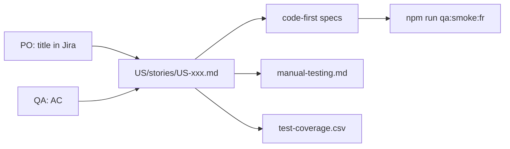

# The Pair Backlog

**PO + QA started together.** PO owns the **title**; QA owns **automation + manual proof**.

## Roles

| Who | Owns |
|-----|------|
| **PO** | Story title in Jira, priority, demo sign-off |
| **QA** | AC, Playwright specs, manual checklists, coverage spreadsheet |

## How a story moves

1. PO creates Jira ticket (title) → paste key on the pair card.
2. QA writes AC (Jira + card + optional Gherkin features).
3. QA automates in `code-first/` **or** documents manual steps.
4. QA updates `docs/spreadsheets/test-coverage.csv`.
5. **PR gate:** `npm run qa:smoke:fr` (storefront running).

## Files

| File | Purpose |
|------|---------|
| [`backlog.md`](backlog.md) | Board view |
| [`epics.md`](epics.md) | Epic goals |
| [`TEMPLATE.md`](TEMPLATE.md) | New story template |
| [`stories/`](stories/) | Pair cards |

## Related

- [`../docs/qa-process.md`](../docs/qa-process.md)
- [`../docs/manual-testing.md`](../docs/manual-testing.md)
- [`../docs/spreadsheets/test-coverage.csv`](../docs/spreadsheets/test-coverage.csv)
